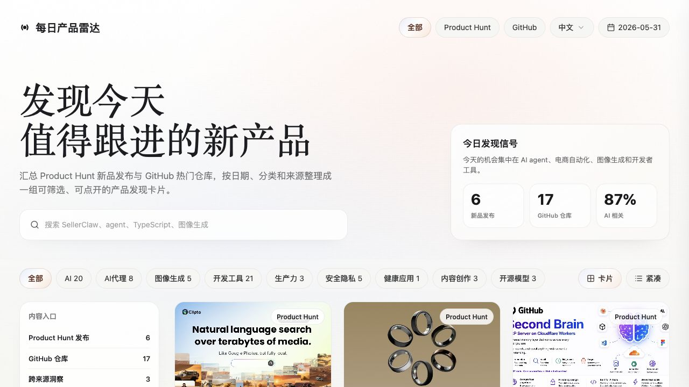

<p align="center">
  
</p>

<h1 align="center">Tutti Apps</h1>

<p align="center">
  <strong>面向 Tutti 工作区的应用开发与打包仓库。</strong>
</p>

<p align="center">
  <a href="./README.md">English</a>
  ·
  <a href="#快速开始">快速开始</a>
  ·
  <a href="#tutti-包模式">Tutti 包模式</a>
  ·
  <a href="#cli-命令">CLI</a>
  ·
  <a href="./docs/README.md">文档</a>
  ·
  <a href="./LICENSE">License</a>
</p>

<p align="center">
  <a href="./LICENSE"></a>
  
  
  
  
  
</p>



Tutti Apps 是一个 pnpm/Turbo monorepo，用来开发小型、自包含的工作区应用。
这些应用可以在本地运行，也可以打包成 Tutti 工作区运行时可安装的应用包。

当前的第一个应用是 **每日产品雷达**：一个基于 TanStack Start 的产品发现看板，
把 Product Hunt 新品发布和 GitHub 热门仓库整理成可搜索、可筛选、可打开详情的发现卡片。

## 功能亮点

- 每日发现看板：在同一个卡片网格中浏览 Product Hunt 新品和 GitHub 仓库。
- 聚焦筛选：支持按来源、日期、分类、语言、关键词和卡片密度快速切换。
- 详情优先：产品卡片可打开媒体、指标、标签和源站链接，方便进一步判断。
- Tutti 打包：将应用 manifest、启动脚本、图标、CLI 元数据、静态资源和服务包装器打包到 `build/tutti-app`。
- 只读 CLI：打包后的安装包暴露 `radar` 命令域，用于查看看板、搜索和查询单个条目。
- 双语界面：应用默认支持 `en-US`，并包含简体中文本地化。

## 快速开始

环境要求：

- Node.js 22 或更新版本
- pnpm 10.26.2，推荐通过 Corepack 使用

```bash
corepack enable
pnpm install
pnpm --filter @tutti-apps/daily-tech-radar dev
```

然后打开：

```txt
http://127.0.0.1:3002
```

运行主要检查：

```bash
pnpm lint
pnpm test
pnpm typecheck
```

## Tutti 包模式

构建 Daily Product Radar 的 Tutti 应用包：

```bash
pnpm package:tutti --app daily-tech-radar
```

产物路径：

```txt
build/tutti-app/daily-tech-radar/package/
build/tutti-app/daily-tech-radar/daily-tech-radar-0.0.0.zip
```

本地运行已打包的服务：

```bash
pnpm --filter @tutti-apps/daily-tech-radar start
```

包内包装器会从 `dist/` 提供静态资源，将 SSR 和 server functions 交给 `server/server.js`，
并暴露 `/api/health` 供 Tutti 运行时做健康检查。

## CLI 命令

Daily Product Radar 包含
[`tutti.cli.json`](./apps/daily-tech-radar/tutti-package/tutti.cli.json)，
在 Tutti 内暴露只读的 `radar` 命令域：

```bash
tutti --json radar board
tutti --json radar board --date 2026-06-05 --locale zh-CN
tutti --json radar search --query agent --source github --limit 10
tutti --json radar item --id github:123456 --locale en-US
```

完整命令说明和响应 envelope 结构见
[`apps/daily-tech-radar/tutti-package/COMMANDS.md`](./apps/daily-tech-radar/tutti-package/COMMANDS.md)。

## 工作区结构

```txt
apps/
  daily-tech-radar/      TanStack Start 应用与 Tutti 包文件
  tutti-onboarding/      静态入门导览与 Tutti 包文件
packages/                多个应用真实复用时再放共享包
docs/                    架构说明和协作约定
scripts/                 仓库级打包与校验脚本
tutti.publish.json      可发布应用注册表
```

边界约定：

- `apps/*` 存放可独立运行的应用。
- `apps/<app-id>/tutti-package` 存放可发布应用的 manifest 和运行时适配文件。
- `packages/*` 只用于多个应用真实复用的共享边界。
- `docs/*` 存放稳定的架构记录、打包说明和 agent 协作约定。

## 文档

- [架构概览](./docs/architecture/README.md)
- [项目结构](./docs/architecture/project-structure.md)
- [构建系统](./docs/architecture/build-system.md)
- [Tutti 打包](./docs/architecture/tutti-packaging.md)
- [Agent 工作流约定](./docs/conventions/agent-workflow.md)
- [Daily Product Radar 应用 README](./apps/daily-tech-radar/README.md)

## 开发

根目录命令会委托给 Turbo：

```bash
pnpm dev
pnpm build
pnpm test
pnpm typecheck
pnpm lint
```

只开发单个应用时使用 package filter：

```bash
pnpm --filter @tutti-apps/daily-tech-radar dev
pnpm --filter @tutti-apps/daily-tech-radar test
pnpm --filter @tutti-apps/daily-tech-radar typecheck
pnpm --filter @tutti-apps/daily-tech-radar i18n:check
```

发布有意义的应用改动前，建议运行：

```bash
pnpm lint
pnpm test
pnpm typecheck
pnpm package:tutti --app daily-tech-radar
```

如果改动了 UI，也需要在浏览器中检查桌面和移动端宽度下的主界面。

## 添加应用

1. 创建 `apps/<app-id>`，包含自己的 `package.json`、`src/` 和校验脚本。
2. 将应用专属的产品逻辑保留在该应用目录内。
3. 只有当多个应用真实需要复用时，才把代码移动到 `packages/*`。
4. 如果应用需要发布，添加 `apps/<app-id>/tutti-package`。
5. 在 `tutti.publish.json` 中注册可发布应用。
6. 当应用复杂度超过根 README 的摘要范围时，在 `apps/<app-id>/docs` 下补充应用文档。

## 当前状态

这个仓库当前包含这些可发布应用：

| 应用 | Package | 路径 |
| --- | --- | --- |
| Daily Product Radar | `@tutti-apps/daily-tech-radar` | `apps/daily-tech-radar` |
| Tutti Onboarding | `@tutti-apps/tutti-onboarding` | `apps/tutti-onboarding` |

## License

Tutti Apps 使用 [Apache License 2.0](./LICENSE) 许可。
